## Monthly Project 1 - EDA
  - 미국에서 무장 범죄자들에 대한 인종차별 이슈를 분석, 부가적으로 나이와 무장 방식의 관계에 대해서 확인
  - Dataset : https://www.kaggle.com/ahsen1330/us-police-shootings

### 변수 확인
  - 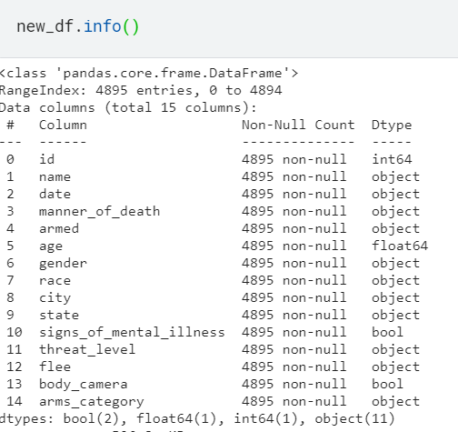
  - id : 번호
  - name : 범인의 이름
  - date : 사건 발생일자
  - manner_of_death : 범죄자의 사망 이유
  - armed : 범죄자의 무장
  - age : 범죄자의 나이
  - gender : 범죄자의 성별
  - race : 범죄자의 인종
  - city : 범죄 발생 도시
  - state : 범죄 발생 주
  - signs_of_mental_illness : 범죄자의 정신질환 여부
  - threat_level : 범죄자에 대한 위협 수준
  - flee : 범죄자의 도피 방식
  - body_camera : 당시 경찰의 바디캠 착용 여부
  - arms_category : 무기의 종류

### 데이터의 개별 속성 파악하기
  - manner_of_death
    - 
    - 대부분이 총격에 의한 사망
    - 일부는 테이저건과 총 2가지에 모두 피격

  - armed
    - 값이 20이하인 경우를 Others로 묶어서 처리
      - 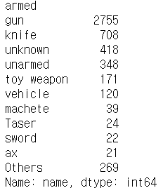
    
    - 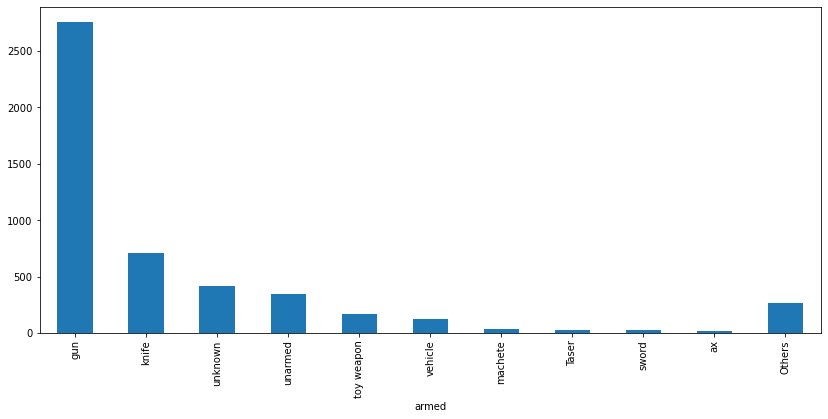
    - 총을 사용한 경우가 가장 많았고 이후 단도, 무장이 확인되지 않은 경우, 비무장, 장난감, 차량 등을 사용한 경우가 존재

  - age
    - 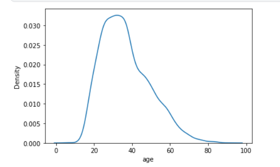
      - 20~40대의 비율이 가장 높음
    - 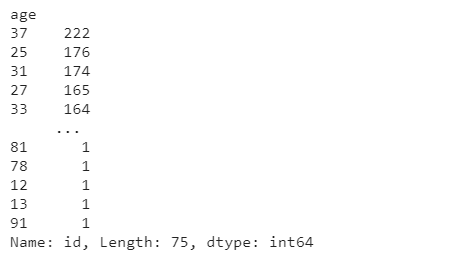
      - 구체적으로 37세, 25세, 31세, 27세 등 20대 후반 ~ 30대 초반이 두드러짐

  - gender
    - 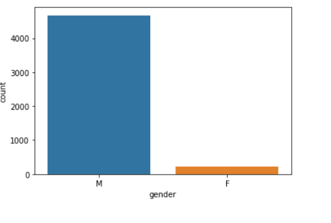
      - 남성이 압도적으로 많음

  - race
    - 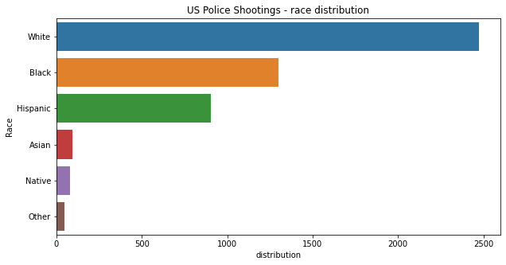
      - 백인 범죄자가 가장 많고 다음으로 흑인, 히스패닉이 주를 이룸

  - threat_level
    - 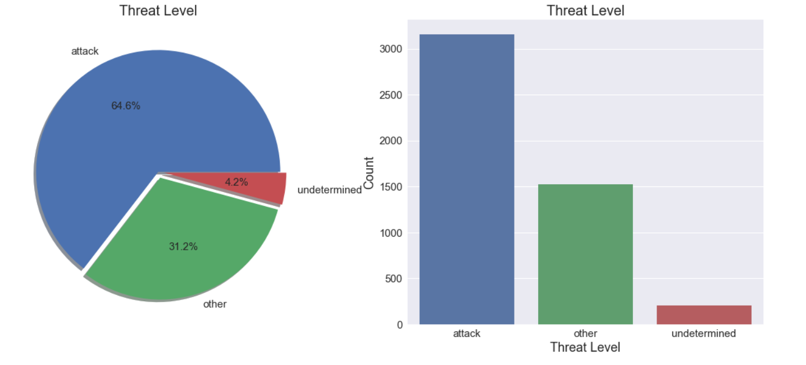
      - 범죄자 대부분이 공격적인 위협을 당함

  - flee
    - 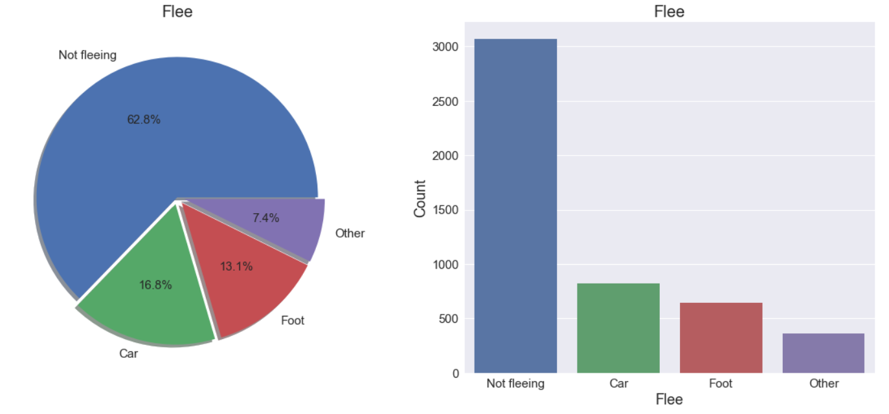
      - 약 63%가 현장에서 바로 검거
      - 도피한 경우에는 차량이 사용된 비율 가장 높음
    
  - city
    - 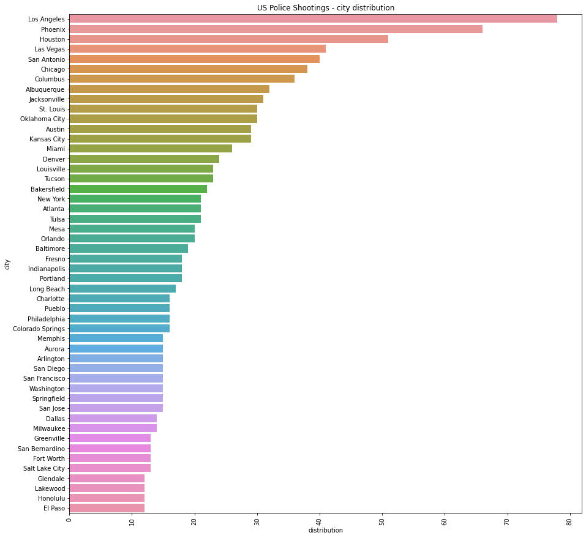
      - 경찰 총격 빈도가 가장 높은 도시는 로스앤젤러스, 피닉스, 휴스턴 순

  - state
    - 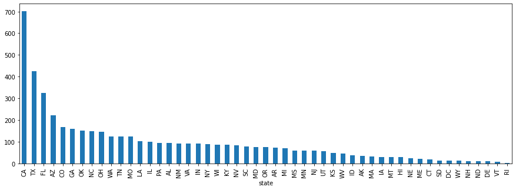
      - 제일 많은 주(state)는 CA(California)이며, TX(Texas), FL(Florida) 순

  - signs_of_mental_illness
    - 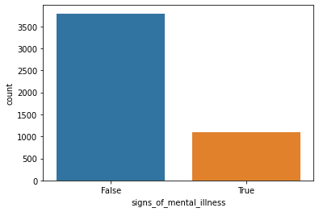
      - 정신 질환이 있는 경우보다 없는 경우가 더 많다.

## 데이터의 복합적인 관계 분석하기
  - 나이 - 무장
    - 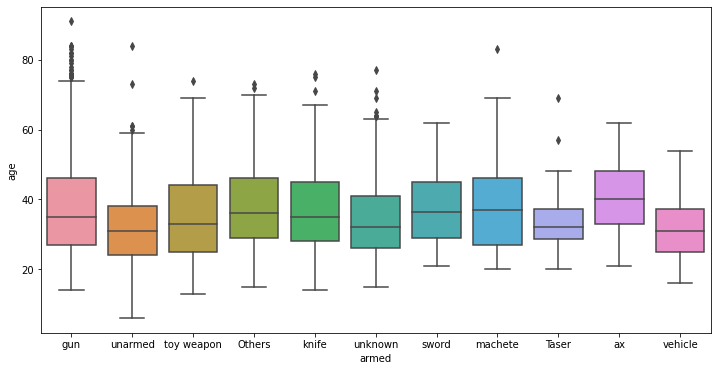
    - 총 (Gun) : 총기 허용 국가인 만큼 거의 전 연령대에서 범죄자가 총기를 사용한 경우가 존재
    - 비무장 (Unarmed) : Teenage 영역에서도 비무장 상태에서 사망한 범죄자가 발생한 경우가 존재
    - 장난감 (Toy) : 주변에서 쉽게 볼수 있는 물건으로 대부분의 연령대에 존재
    - 단도 (Knife) : 주변에서 쉽게 볼수 있는 물건으로 대부분의 연령대에 존재
    - 장검 (Sword), 도끼(Axe), 마체테(Machete) : 크기가 크고 무겁기에 대부분 20대 ~ 60대에 존재
    - 테이저건 (Taser) : 가장 좁은 나이 범위에서 발생

  - 인종 - 위협수준
    - 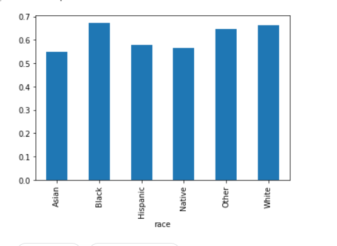
    - Black의 위협 수준이 가장 높았으나, 다른 인종과의 큰 차이가 없었다.

  - 인종 - 사망 이유
    - 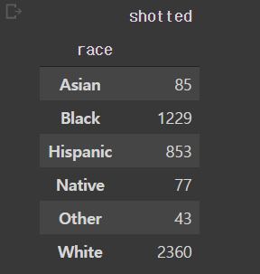
      - White 2360, Black 1229회, Hispanic 853회, Asian 85회, Native 77회 순으로 백인의 경우 총격으로 사망한 경우가 가장 높다는 것을 알 수 있다. 
